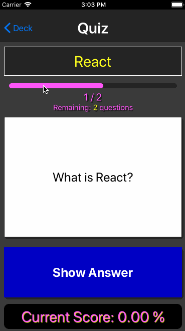
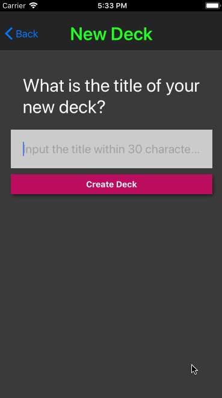

# Readable
## Udacity React ND 3rd project
### Getting started
##### 1. Open your terminal and clone this repository in a directory you like:
```
$ git clone https://github.com/nekki-t/udacity-project-mobile-flashcards.git
```
##### 2. Move to the directory which you cloned to:
```
e.g.
$ cd /{directory}/udacity-project-mobile-flashcards
```
##### 3.  Install modules:
```
$ yarn
```
##### 4. Run app:
```
$ yarn start)
```
#### Tested platform
This app was tested on iOS platform.

## Demo
#### 1. You can play with card decks.


#### 2. You can create your own card decks and cards.



